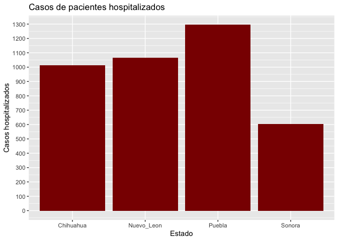
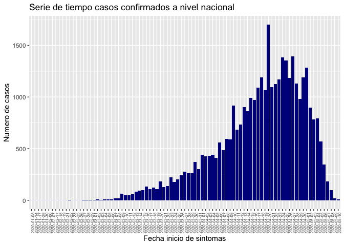

Examen de conocimiento de programación MCD-UNISON
================

## Información

Este script es parte del examen de conocimiento de programación para la
Maestría en Ciencia de Datos de la Universidad de Sonora. Se hace uso de
Rmarkdown para hacer las manipulaciones necesarias con el conjunto de
datos.

**Autor:** Hugo de Jesús Valenzuela Chaparro

**Código fuente en:** ValenzuelaHugo\_examen-prog-mcd.Rmd

**Fecha:** 4 de junio del 2021

## Librerias necesarias

``` r
library(dplyr)
library(ggplot2)
library(gt)
```

## Importamos el conjunto de datos

``` r
data_raw <- read.csv("/Users/hugo/examen_mcd_2021/examen-prog/covid-data/200511COVID19MEXICO.csv",
                     header = T, sep = ",")
```

## Generación de la tabla 1

Se utilizan funciones de la librería dplyer para hacer las respectivas
filtraciones en el conjunto de datos. En este caso se nos está
requiriendo obtener de los datos aquellos casos positivos a SARS-CoV2 en
Sonora que lamentablemente fallecieron (fecha de defunción distinta a
“9999-99-99”). Corroboramos también que tengan registrada una fecha de
inicio de síntomas, es decir, distinta a “9999-99-99”.

Después de filtrar, las tres columnas que se extraen son fecha de
actualización, fecha de inicio de sintomas y fecha de defunción.

``` r
#filtramos usando pipelines, con filter() condicionamos y con select() extraemos columnas
# Sonora tiene clave de Estado 26, resultado positivo SARS-CoV2 indicado con 1
data_son <- data_raw %>% filter(ENTIDAD_RES == 26 & RESULTADO == 1
                                & FECHA_SINTOMAS != "9999-99-99"
                                & FECHA_DEF != "9999-99-99") %>%
                         select(FECHA_ACTUALIZACION, FECHA_SINTOMAS, FECHA_DEF)
```

Se exportan los datos obtenidos a una tabla llamada tabla1:

``` r
write.csv(data_son , file = "tabla1.csv", row.names = F)
```

Imprimimos un preview de la tabla para este documento:

``` r
# se hace uso de la libreria gt para imprimir la tabla en el documento
#tabla_1 <- gt(data = data_son)
tabla_1 <- gt_preview(data = data_son, top_n = 5, bottom_n = 5, incl_rownums = TRUE)
tabla_1 <- 
  tabla_1 %>%
  tab_header(
    title = "Casos positivos SARS-CoV2 en Sonora",
    subtitle = "pacientes que lamentablemente fallecieron"
  )
tabla_1
```

<div id="mdxjrkpujy" style="overflow-x:auto;overflow-y:auto;width:auto;height:auto;">
<style>html {
  font-family: -apple-system, BlinkMacSystemFont, 'Segoe UI', Roboto, Oxygen, Ubuntu, Cantarell, 'Helvetica Neue', 'Fira Sans', 'Droid Sans', Arial, sans-serif;
}

#mdxjrkpujy .gt_table {
  display: table;
  border-collapse: collapse;
  margin-left: auto;
  margin-right: auto;
  color: #333333;
  font-size: 16px;
  font-weight: normal;
  font-style: normal;
  background-color: #FFFFFF;
  width: auto;
  border-top-style: solid;
  border-top-width: 2px;
  border-top-color: #A8A8A8;
  border-right-style: none;
  border-right-width: 2px;
  border-right-color: #D3D3D3;
  border-bottom-style: solid;
  border-bottom-width: 2px;
  border-bottom-color: #A8A8A8;
  border-left-style: none;
  border-left-width: 2px;
  border-left-color: #D3D3D3;
}

#mdxjrkpujy .gt_heading {
  background-color: #FFFFFF;
  text-align: center;
  border-bottom-color: #FFFFFF;
  border-left-style: none;
  border-left-width: 1px;
  border-left-color: #D3D3D3;
  border-right-style: none;
  border-right-width: 1px;
  border-right-color: #D3D3D3;
}

#mdxjrkpujy .gt_title {
  color: #333333;
  font-size: 125%;
  font-weight: initial;
  padding-top: 4px;
  padding-bottom: 4px;
  border-bottom-color: #FFFFFF;
  border-bottom-width: 0;
}

#mdxjrkpujy .gt_subtitle {
  color: #333333;
  font-size: 85%;
  font-weight: initial;
  padding-top: 0;
  padding-bottom: 4px;
  border-top-color: #FFFFFF;
  border-top-width: 0;
}

#mdxjrkpujy .gt_bottom_border {
  border-bottom-style: solid;
  border-bottom-width: 2px;
  border-bottom-color: #D3D3D3;
}

#mdxjrkpujy .gt_col_headings {
  border-top-style: solid;
  border-top-width: 2px;
  border-top-color: #D3D3D3;
  border-bottom-style: solid;
  border-bottom-width: 2px;
  border-bottom-color: #D3D3D3;
  border-left-style: none;
  border-left-width: 1px;
  border-left-color: #D3D3D3;
  border-right-style: none;
  border-right-width: 1px;
  border-right-color: #D3D3D3;
}

#mdxjrkpujy .gt_col_heading {
  color: #333333;
  background-color: #FFFFFF;
  font-size: 100%;
  font-weight: normal;
  text-transform: inherit;
  border-left-style: none;
  border-left-width: 1px;
  border-left-color: #D3D3D3;
  border-right-style: none;
  border-right-width: 1px;
  border-right-color: #D3D3D3;
  vertical-align: bottom;
  padding-top: 5px;
  padding-bottom: 6px;
  padding-left: 5px;
  padding-right: 5px;
  overflow-x: hidden;
}

#mdxjrkpujy .gt_column_spanner_outer {
  color: #333333;
  background-color: #FFFFFF;
  font-size: 100%;
  font-weight: normal;
  text-transform: inherit;
  padding-top: 0;
  padding-bottom: 0;
  padding-left: 4px;
  padding-right: 4px;
}

#mdxjrkpujy .gt_column_spanner_outer:first-child {
  padding-left: 0;
}

#mdxjrkpujy .gt_column_spanner_outer:last-child {
  padding-right: 0;
}

#mdxjrkpujy .gt_column_spanner {
  border-bottom-style: solid;
  border-bottom-width: 2px;
  border-bottom-color: #D3D3D3;
  vertical-align: bottom;
  padding-top: 5px;
  padding-bottom: 6px;
  overflow-x: hidden;
  display: inline-block;
  width: 100%;
}

#mdxjrkpujy .gt_group_heading {
  padding: 8px;
  color: #333333;
  background-color: #FFFFFF;
  font-size: 100%;
  font-weight: initial;
  text-transform: inherit;
  border-top-style: solid;
  border-top-width: 2px;
  border-top-color: #D3D3D3;
  border-bottom-style: solid;
  border-bottom-width: 2px;
  border-bottom-color: #D3D3D3;
  border-left-style: none;
  border-left-width: 1px;
  border-left-color: #D3D3D3;
  border-right-style: none;
  border-right-width: 1px;
  border-right-color: #D3D3D3;
  vertical-align: middle;
}

#mdxjrkpujy .gt_empty_group_heading {
  padding: 0.5px;
  color: #333333;
  background-color: #FFFFFF;
  font-size: 100%;
  font-weight: initial;
  border-top-style: solid;
  border-top-width: 2px;
  border-top-color: #D3D3D3;
  border-bottom-style: solid;
  border-bottom-width: 2px;
  border-bottom-color: #D3D3D3;
  vertical-align: middle;
}

#mdxjrkpujy .gt_from_md > :first-child {
  margin-top: 0;
}

#mdxjrkpujy .gt_from_md > :last-child {
  margin-bottom: 0;
}

#mdxjrkpujy .gt_row {
  padding-top: 8px;
  padding-bottom: 8px;
  padding-left: 5px;
  padding-right: 5px;
  margin: 10px;
  border-top-style: solid;
  border-top-width: 1px;
  border-top-color: #D3D3D3;
  border-left-style: none;
  border-left-width: 1px;
  border-left-color: #D3D3D3;
  border-right-style: none;
  border-right-width: 1px;
  border-right-color: #D3D3D3;
  vertical-align: middle;
  overflow-x: hidden;
}

#mdxjrkpujy .gt_stub {
  color: #333333;
  background-color: #FFFFFF;
  font-size: 100%;
  font-weight: initial;
  text-transform: inherit;
  border-right-style: solid;
  border-right-width: 2px;
  border-right-color: #D3D3D3;
  padding-left: 12px;
}

#mdxjrkpujy .gt_summary_row {
  color: #333333;
  background-color: #FFFFFF;
  text-transform: inherit;
  padding-top: 8px;
  padding-bottom: 8px;
  padding-left: 5px;
  padding-right: 5px;
}

#mdxjrkpujy .gt_first_summary_row {
  padding-top: 8px;
  padding-bottom: 8px;
  padding-left: 5px;
  padding-right: 5px;
  border-top-style: solid;
  border-top-width: 2px;
  border-top-color: #D3D3D3;
}

#mdxjrkpujy .gt_grand_summary_row {
  color: #333333;
  background-color: #FFFFFF;
  text-transform: inherit;
  padding-top: 8px;
  padding-bottom: 8px;
  padding-left: 5px;
  padding-right: 5px;
}

#mdxjrkpujy .gt_first_grand_summary_row {
  padding-top: 8px;
  padding-bottom: 8px;
  padding-left: 5px;
  padding-right: 5px;
  border-top-style: double;
  border-top-width: 6px;
  border-top-color: #D3D3D3;
}

#mdxjrkpujy .gt_striped {
  background-color: rgba(128, 128, 128, 0.05);
}

#mdxjrkpujy .gt_table_body {
  border-top-style: solid;
  border-top-width: 2px;
  border-top-color: #D3D3D3;
  border-bottom-style: solid;
  border-bottom-width: 2px;
  border-bottom-color: #D3D3D3;
}

#mdxjrkpujy .gt_footnotes {
  color: #333333;
  background-color: #FFFFFF;
  border-bottom-style: none;
  border-bottom-width: 2px;
  border-bottom-color: #D3D3D3;
  border-left-style: none;
  border-left-width: 2px;
  border-left-color: #D3D3D3;
  border-right-style: none;
  border-right-width: 2px;
  border-right-color: #D3D3D3;
}

#mdxjrkpujy .gt_footnote {
  margin: 0px;
  font-size: 90%;
  padding: 4px;
}

#mdxjrkpujy .gt_sourcenotes {
  color: #333333;
  background-color: #FFFFFF;
  border-bottom-style: none;
  border-bottom-width: 2px;
  border-bottom-color: #D3D3D3;
  border-left-style: none;
  border-left-width: 2px;
  border-left-color: #D3D3D3;
  border-right-style: none;
  border-right-width: 2px;
  border-right-color: #D3D3D3;
}

#mdxjrkpujy .gt_sourcenote {
  font-size: 90%;
  padding: 4px;
}

#mdxjrkpujy .gt_left {
  text-align: left;
}

#mdxjrkpujy .gt_center {
  text-align: center;
}

#mdxjrkpujy .gt_right {
  text-align: right;
  font-variant-numeric: tabular-nums;
}

#mdxjrkpujy .gt_font_normal {
  font-weight: normal;
}

#mdxjrkpujy .gt_font_bold {
  font-weight: bold;
}

#mdxjrkpujy .gt_font_italic {
  font-style: italic;
}

#mdxjrkpujy .gt_super {
  font-size: 65%;
}

#mdxjrkpujy .gt_footnote_marks {
  font-style: italic;
  font-weight: normal;
  font-size: 65%;
}
</style>
<table class="gt_table">
  <thead class="gt_header">
    <tr>
      <th colspan="4" class="gt_heading gt_title gt_font_normal" style>Casos positivos SARS-CoV2 en Sonora</th>
    </tr>
    <tr>
      <th colspan="4" class="gt_heading gt_subtitle gt_font_normal gt_bottom_border" style>pacientes que lamentablemente fallecieron</th>
    </tr>
  </thead>
  <thead class="gt_col_headings">
    <tr>
      <th class="gt_col_heading gt_columns_bottom_border gt_left" rowspan="1" colspan="1"></th>
      <th class="gt_col_heading gt_columns_bottom_border gt_left" rowspan="1" colspan="1">FECHA_ACTUALIZACION</th>
      <th class="gt_col_heading gt_columns_bottom_border gt_left" rowspan="1" colspan="1">FECHA_SINTOMAS</th>
      <th class="gt_col_heading gt_columns_bottom_border gt_left" rowspan="1" colspan="1">FECHA_DEF</th>
    </tr>
  </thead>
  <tbody class="gt_table_body">
    <tr><td class="gt_row gt_left gt_stub" style="font-family: Courier;">1</td>
<td class="gt_row gt_left">2020-05-11</td>
<td class="gt_row gt_left">2020-04-09</td>
<td class="gt_row gt_left">2020-04-22</td></tr>
    <tr><td class="gt_row gt_left gt_stub" style="font-family: Courier;">2</td>
<td class="gt_row gt_left">2020-05-11</td>
<td class="gt_row gt_left">2020-04-08</td>
<td class="gt_row gt_left">2020-04-15</td></tr>
    <tr><td class="gt_row gt_left gt_stub" style="font-family: Courier;">3</td>
<td class="gt_row gt_left">2020-05-11</td>
<td class="gt_row gt_left">2020-03-30</td>
<td class="gt_row gt_left">2020-04-08</td></tr>
    <tr><td class="gt_row gt_left gt_stub" style="font-family: Courier;">4</td>
<td class="gt_row gt_left">2020-05-11</td>
<td class="gt_row gt_left">2020-03-20</td>
<td class="gt_row gt_left">2020-04-05</td></tr>
    <tr><td class="gt_row gt_left gt_stub" style="font-family: Courier;">5</td>
<td class="gt_row gt_left">2020-05-11</td>
<td class="gt_row gt_left">2020-04-13</td>
<td class="gt_row gt_left">2020-04-21</td></tr>
    <tr><td class="gt_row gt_left gt_stub" style="font-family: Courier; font-size: x-small; background-color: #E4E4E4;">6..28</td>
<td class="gt_row gt_left" style="background-color: #E4E4E4;"></td>
<td class="gt_row gt_left" style="background-color: #E4E4E4;"></td>
<td class="gt_row gt_left" style="background-color: #E4E4E4;"></td></tr>
    <tr><td class="gt_row gt_left gt_stub" style="font-family: Courier;">29</td>
<td class="gt_row gt_left">2020-05-11</td>
<td class="gt_row gt_left">2020-03-28</td>
<td class="gt_row gt_left">2020-04-12</td></tr>
    <tr><td class="gt_row gt_left gt_stub" style="font-family: Courier;">30</td>
<td class="gt_row gt_left">2020-05-11</td>
<td class="gt_row gt_left">2020-04-10</td>
<td class="gt_row gt_left">2020-04-21</td></tr>
    <tr><td class="gt_row gt_left gt_stub" style="font-family: Courier;">31</td>
<td class="gt_row gt_left">2020-05-11</td>
<td class="gt_row gt_left">2020-03-22</td>
<td class="gt_row gt_left">2020-04-12</td></tr>
    <tr><td class="gt_row gt_left gt_stub" style="font-family: Courier;">32</td>
<td class="gt_row gt_left">2020-05-11</td>
<td class="gt_row gt_left">2020-04-18</td>
<td class="gt_row gt_left">2020-04-25</td></tr>
    <tr><td class="gt_row gt_left gt_stub" style="font-family: Courier;">33</td>
<td class="gt_row gt_left">2020-05-11</td>
<td class="gt_row gt_left">2020-04-20</td>
<td class="gt_row gt_left">2020-05-04</td></tr>
  </tbody>
  
  
</table>
</div>

**NOTA:** En lugar de una columna de confirmados, agregué la columna de
fecha de actualización. Creo que no hay problema pues ambas columnas
serían un poco redundantes de igual manera, esta fecha de actualización
da la misma fecha mientras que la de confirmados solamente daría un
número 1.

## Generación de la tabla 2

En esta tabla se nos pide contabilizar los casos hospitalizados en los
Estados de Sonora, Chihuahua, Nuevo León y Puebla, con claves 26, 8, 19
y 21, respectivamente. Procedemos primero creando el tibble o tabla que
alojara dicha información.

``` r
# inicializando tibble para los Estados y la cantidad de personas hospitalizadas
Estados <- c("Sonora", "Chihuahua", "Nuevo_Leon", "Puebla")
cantidad_hosp <- tibble(Estado = Estados,
                        Casos_hospitalizados = c(0, 0, 0, 0))
```

Hacemos un loop sobre las claves de Estados para contabilizar los casos
hospitalizados en los Estados mencionados anteriormente, y se irá
añadiendo el resultado en el tibble `cantidad_hosp` que se inicializó

``` r
# la variable contador ira determinando en cual renglon del tibble se ira guardando el numero de 
# pacientes hospitalizados obtenidos con filter(), el orden del loop va de Sonora, Chihuahua,
# Nuevo Leon y Puebla

contador <- 1
for (i in c(26, 8, 19, 21)){
  n <- data_raw %>% filter(ENTIDAD_RES == i & TIPO_PACIENTE == 2) %>%
                  summarise(count = n()) # num. hospitalizados
  cantidad_hosp[contador, 2] <- n # guardar en tibble
  contador <- contador + 1
}
```

Ahora, exportamos los resultados guardados en el tibble a una tabla csv
llamada tabla 2

``` r
write.csv(cantidad_hosp , file = "tabla2.csv", row.names = F)
```

Imprimimos la tabla para este documento:

``` r
# se hace uso de la libreria gt para imprimir la tabla en el documento
tabla_2 <- gt(data = cantidad_hosp)
tabla_2 <- 
  tabla_2 %>%
  tab_header(
    title = "Casos de pacientes hospitalizados",
    subtitle = "En Sonora, Chihuahua, Nuevo León y Puebla"
  )
tabla_2
```

<div id="ipufxtmeze" style="overflow-x:auto;overflow-y:auto;width:auto;height:auto;">
<style>html {
  font-family: -apple-system, BlinkMacSystemFont, 'Segoe UI', Roboto, Oxygen, Ubuntu, Cantarell, 'Helvetica Neue', 'Fira Sans', 'Droid Sans', Arial, sans-serif;
}

#ipufxtmeze .gt_table {
  display: table;
  border-collapse: collapse;
  margin-left: auto;
  margin-right: auto;
  color: #333333;
  font-size: 16px;
  font-weight: normal;
  font-style: normal;
  background-color: #FFFFFF;
  width: auto;
  border-top-style: solid;
  border-top-width: 2px;
  border-top-color: #A8A8A8;
  border-right-style: none;
  border-right-width: 2px;
  border-right-color: #D3D3D3;
  border-bottom-style: solid;
  border-bottom-width: 2px;
  border-bottom-color: #A8A8A8;
  border-left-style: none;
  border-left-width: 2px;
  border-left-color: #D3D3D3;
}

#ipufxtmeze .gt_heading {
  background-color: #FFFFFF;
  text-align: center;
  border-bottom-color: #FFFFFF;
  border-left-style: none;
  border-left-width: 1px;
  border-left-color: #D3D3D3;
  border-right-style: none;
  border-right-width: 1px;
  border-right-color: #D3D3D3;
}

#ipufxtmeze .gt_title {
  color: #333333;
  font-size: 125%;
  font-weight: initial;
  padding-top: 4px;
  padding-bottom: 4px;
  border-bottom-color: #FFFFFF;
  border-bottom-width: 0;
}

#ipufxtmeze .gt_subtitle {
  color: #333333;
  font-size: 85%;
  font-weight: initial;
  padding-top: 0;
  padding-bottom: 4px;
  border-top-color: #FFFFFF;
  border-top-width: 0;
}

#ipufxtmeze .gt_bottom_border {
  border-bottom-style: solid;
  border-bottom-width: 2px;
  border-bottom-color: #D3D3D3;
}

#ipufxtmeze .gt_col_headings {
  border-top-style: solid;
  border-top-width: 2px;
  border-top-color: #D3D3D3;
  border-bottom-style: solid;
  border-bottom-width: 2px;
  border-bottom-color: #D3D3D3;
  border-left-style: none;
  border-left-width: 1px;
  border-left-color: #D3D3D3;
  border-right-style: none;
  border-right-width: 1px;
  border-right-color: #D3D3D3;
}

#ipufxtmeze .gt_col_heading {
  color: #333333;
  background-color: #FFFFFF;
  font-size: 100%;
  font-weight: normal;
  text-transform: inherit;
  border-left-style: none;
  border-left-width: 1px;
  border-left-color: #D3D3D3;
  border-right-style: none;
  border-right-width: 1px;
  border-right-color: #D3D3D3;
  vertical-align: bottom;
  padding-top: 5px;
  padding-bottom: 6px;
  padding-left: 5px;
  padding-right: 5px;
  overflow-x: hidden;
}

#ipufxtmeze .gt_column_spanner_outer {
  color: #333333;
  background-color: #FFFFFF;
  font-size: 100%;
  font-weight: normal;
  text-transform: inherit;
  padding-top: 0;
  padding-bottom: 0;
  padding-left: 4px;
  padding-right: 4px;
}

#ipufxtmeze .gt_column_spanner_outer:first-child {
  padding-left: 0;
}

#ipufxtmeze .gt_column_spanner_outer:last-child {
  padding-right: 0;
}

#ipufxtmeze .gt_column_spanner {
  border-bottom-style: solid;
  border-bottom-width: 2px;
  border-bottom-color: #D3D3D3;
  vertical-align: bottom;
  padding-top: 5px;
  padding-bottom: 6px;
  overflow-x: hidden;
  display: inline-block;
  width: 100%;
}

#ipufxtmeze .gt_group_heading {
  padding: 8px;
  color: #333333;
  background-color: #FFFFFF;
  font-size: 100%;
  font-weight: initial;
  text-transform: inherit;
  border-top-style: solid;
  border-top-width: 2px;
  border-top-color: #D3D3D3;
  border-bottom-style: solid;
  border-bottom-width: 2px;
  border-bottom-color: #D3D3D3;
  border-left-style: none;
  border-left-width: 1px;
  border-left-color: #D3D3D3;
  border-right-style: none;
  border-right-width: 1px;
  border-right-color: #D3D3D3;
  vertical-align: middle;
}

#ipufxtmeze .gt_empty_group_heading {
  padding: 0.5px;
  color: #333333;
  background-color: #FFFFFF;
  font-size: 100%;
  font-weight: initial;
  border-top-style: solid;
  border-top-width: 2px;
  border-top-color: #D3D3D3;
  border-bottom-style: solid;
  border-bottom-width: 2px;
  border-bottom-color: #D3D3D3;
  vertical-align: middle;
}

#ipufxtmeze .gt_from_md > :first-child {
  margin-top: 0;
}

#ipufxtmeze .gt_from_md > :last-child {
  margin-bottom: 0;
}

#ipufxtmeze .gt_row {
  padding-top: 8px;
  padding-bottom: 8px;
  padding-left: 5px;
  padding-right: 5px;
  margin: 10px;
  border-top-style: solid;
  border-top-width: 1px;
  border-top-color: #D3D3D3;
  border-left-style: none;
  border-left-width: 1px;
  border-left-color: #D3D3D3;
  border-right-style: none;
  border-right-width: 1px;
  border-right-color: #D3D3D3;
  vertical-align: middle;
  overflow-x: hidden;
}

#ipufxtmeze .gt_stub {
  color: #333333;
  background-color: #FFFFFF;
  font-size: 100%;
  font-weight: initial;
  text-transform: inherit;
  border-right-style: solid;
  border-right-width: 2px;
  border-right-color: #D3D3D3;
  padding-left: 12px;
}

#ipufxtmeze .gt_summary_row {
  color: #333333;
  background-color: #FFFFFF;
  text-transform: inherit;
  padding-top: 8px;
  padding-bottom: 8px;
  padding-left: 5px;
  padding-right: 5px;
}

#ipufxtmeze .gt_first_summary_row {
  padding-top: 8px;
  padding-bottom: 8px;
  padding-left: 5px;
  padding-right: 5px;
  border-top-style: solid;
  border-top-width: 2px;
  border-top-color: #D3D3D3;
}

#ipufxtmeze .gt_grand_summary_row {
  color: #333333;
  background-color: #FFFFFF;
  text-transform: inherit;
  padding-top: 8px;
  padding-bottom: 8px;
  padding-left: 5px;
  padding-right: 5px;
}

#ipufxtmeze .gt_first_grand_summary_row {
  padding-top: 8px;
  padding-bottom: 8px;
  padding-left: 5px;
  padding-right: 5px;
  border-top-style: double;
  border-top-width: 6px;
  border-top-color: #D3D3D3;
}

#ipufxtmeze .gt_striped {
  background-color: rgba(128, 128, 128, 0.05);
}

#ipufxtmeze .gt_table_body {
  border-top-style: solid;
  border-top-width: 2px;
  border-top-color: #D3D3D3;
  border-bottom-style: solid;
  border-bottom-width: 2px;
  border-bottom-color: #D3D3D3;
}

#ipufxtmeze .gt_footnotes {
  color: #333333;
  background-color: #FFFFFF;
  border-bottom-style: none;
  border-bottom-width: 2px;
  border-bottom-color: #D3D3D3;
  border-left-style: none;
  border-left-width: 2px;
  border-left-color: #D3D3D3;
  border-right-style: none;
  border-right-width: 2px;
  border-right-color: #D3D3D3;
}

#ipufxtmeze .gt_footnote {
  margin: 0px;
  font-size: 90%;
  padding: 4px;
}

#ipufxtmeze .gt_sourcenotes {
  color: #333333;
  background-color: #FFFFFF;
  border-bottom-style: none;
  border-bottom-width: 2px;
  border-bottom-color: #D3D3D3;
  border-left-style: none;
  border-left-width: 2px;
  border-left-color: #D3D3D3;
  border-right-style: none;
  border-right-width: 2px;
  border-right-color: #D3D3D3;
}

#ipufxtmeze .gt_sourcenote {
  font-size: 90%;
  padding: 4px;
}

#ipufxtmeze .gt_left {
  text-align: left;
}

#ipufxtmeze .gt_center {
  text-align: center;
}

#ipufxtmeze .gt_right {
  text-align: right;
  font-variant-numeric: tabular-nums;
}

#ipufxtmeze .gt_font_normal {
  font-weight: normal;
}

#ipufxtmeze .gt_font_bold {
  font-weight: bold;
}

#ipufxtmeze .gt_font_italic {
  font-style: italic;
}

#ipufxtmeze .gt_super {
  font-size: 65%;
}

#ipufxtmeze .gt_footnote_marks {
  font-style: italic;
  font-weight: normal;
  font-size: 65%;
}
</style>
<table class="gt_table">
  <thead class="gt_header">
    <tr>
      <th colspan="2" class="gt_heading gt_title gt_font_normal" style>Casos de pacientes hospitalizados</th>
    </tr>
    <tr>
      <th colspan="2" class="gt_heading gt_subtitle gt_font_normal gt_bottom_border" style>En Sonora, Chihuahua, Nuevo León y Puebla</th>
    </tr>
  </thead>
  <thead class="gt_col_headings">
    <tr>
      <th class="gt_col_heading gt_columns_bottom_border gt_left" rowspan="1" colspan="1">Estado</th>
      <th class="gt_col_heading gt_columns_bottom_border gt_right" rowspan="1" colspan="1">Casos_hospitalizados</th>
    </tr>
  </thead>
  <tbody class="gt_table_body">
    <tr><td class="gt_row gt_left">Sonora</td>
<td class="gt_row gt_right">604</td></tr>
    <tr><td class="gt_row gt_left">Chihuahua</td>
<td class="gt_row gt_right">1013</td></tr>
    <tr><td class="gt_row gt_left">Nuevo_Leon</td>
<td class="gt_row gt_right">1065</td></tr>
    <tr><td class="gt_row gt_left">Puebla</td>
<td class="gt_row gt_right">1295</td></tr>
  </tbody>
  
  
</table>
</div>

## Gráficas

### Gráfica 1: Casos hospitalizados en Sonora, Chihuahua, Nuevo León y Puebla

``` r
# Graficamos usando ggplot2 de tidyverse
ggplot(data = cantidad_hosp, aes(x = Estado, y = Casos_hospitalizados)) + 
  geom_bar(stat = "identity", fill = "red4") + labs(y = "Casos hospitalizados") + 
  scale_y_continuous(breaks = seq(0,1400,100)) + 
  ggtitle("Casos de pacientes hospitalizados")
```

<!-- -->

``` r
# exportar grafica
ggsave("grafica1.png", dpi = 200)
```

    ## Saving 7 x 5 in image

### Gráfica 2: Confirmados a nivel nacional en el tiempo

En la última gráfica, se nos pide una serie de tiempo de los pacientes
confirmados de SARS-CoV2 a nivel nacional, para la referencia temporal
utilizaré la fecha de inicio de síntomas.

``` r
# filtramos para obtener casos positivos y que tengan confirmada una fecha de inicio de
# sintomas
serie_tiempo <-  data_raw %>% filter(RESULTADO == 1 
                                     & FECHA_SINTOMAS != "9999-99-99")
```

Realizamos la gráfica de la serie de tiempo con ayuda de ggplot2

``` r
ggplot(data = serie_tiempo) + geom_bar(aes(x = FECHA_SINTOMAS), fill = "blue4") +
  labs(x = "Fecha inicio de sintomas", y = "Numero de casos") + 
  ggtitle("Serie de tiempo casos confirmados a nivel nacional") +
  theme(axis.text.x=element_text(angle=90, hjust=1, size = 6))
```

<!-- -->

``` r
# exportar grafica
ggsave("grafica2.png", dpi = 200)
```

    ## Saving 7 x 5 in image
